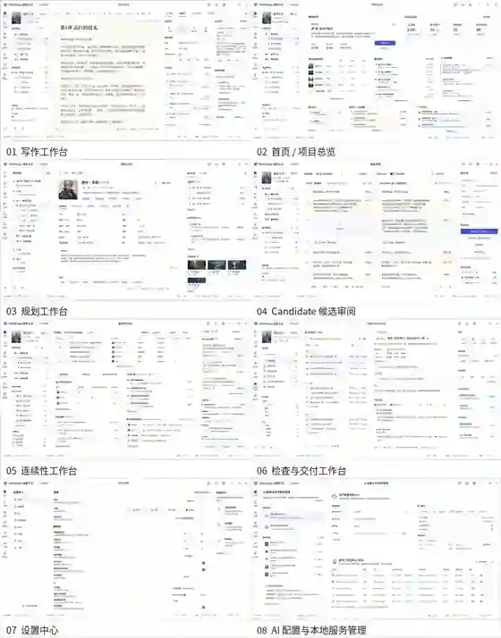

# WorldForge UI 设计样图

> 状态：概念样图。依据当前 UI、交互与功能设计生成，不代表已经实现的产品界面，也不能作为测试或验收证据。

## 套图总览

总览包含以下 8 个核心界面：

1. 写作工作台
2. 首页 / 项目总览
3. 规划工作台
4. Candidate 候选审阅
5. 连续性工作台
6. 检查与交付工作台
7. 设置中心
8. AI 配置与本地服务管理

## 使用边界

- 样图用于统一视觉方向、页面结构和交互讨论。
- 实际实现必须以冻结设计文档、工程契约、任务卡和测试为准。
- 图中文字属于示意内容，不作为正式字段命名、数据模型或 IPC 契约。
- 仓库内保存的是优化后的套图预览总览，避免设计资源无控制膨胀。
